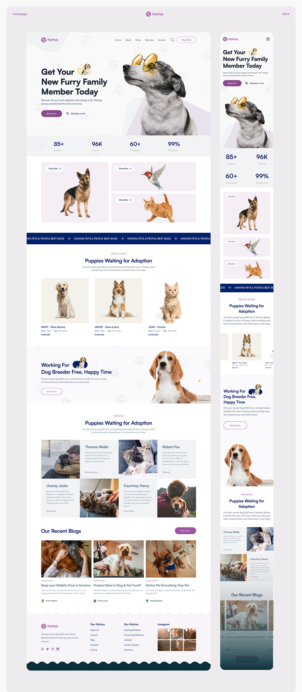
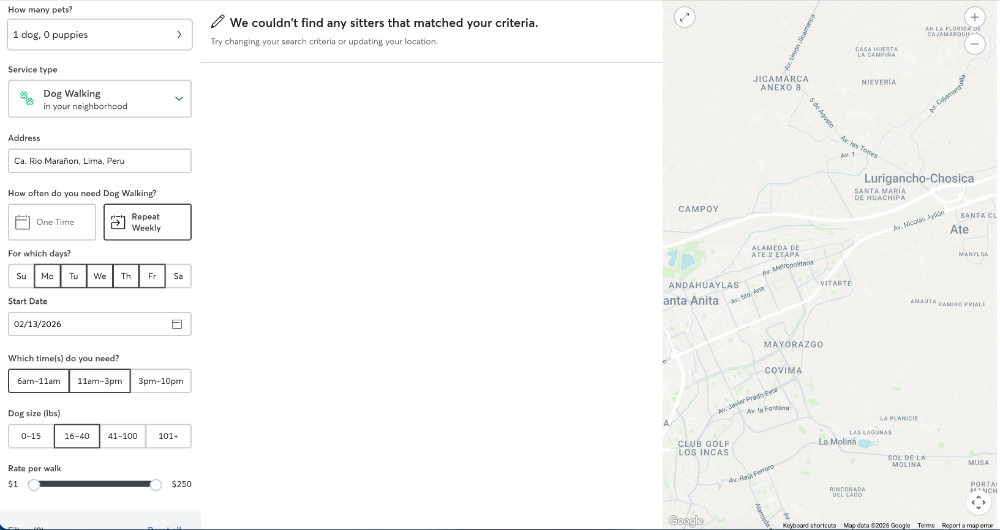

# Design Brief — UrbanDog
### Guía de Diseño y Referencias Visuales

**Versión:** 1.0  
**Fecha:** 13 de febrero de 2026  
**Estado:** Borrador para completar

---

## 1. Contexto del Proyecto

UrbanDog es una plataforma web responsive que conecta dueños de mascotas con paseadores de perros verificados en Lima, Perú. El tono de la marca es **amigable y divertido**, orientado a un público joven (paseadores 18-25 años) y dueños de mascotas de NSE medio-alto.

---

## 2. Referencias Visuales

> Instrucciones: Pega aquí tus screenshots o URLs de referencia. Para cada una, indica qué te gusta y qué cambiarías.

### Referencia 1
- **Imagen/URL:**
  ()
- **¿Qué te gusta de esta referencia?**
  R:El estilo de las fotografías de animales y la predominancia de colores claros
- **¿Qué cambiarías?**
  R:En aspectos de diseño, nada.

### Referencia 2
- **Imagen/URL:**
  (https://www.rover.com)
- **¿Qué te gusta de esta referencia?**
  R:el formulario que tiene para búsqueda y las tarjetas con imágenes e íconos.
- **¿Qué cambiarías?**
  R: Se muestra demasiado texto

### Referencia 3
- **Imagen/URL:**
  (https://wagwalking.com)
- **¿Qué te gusta de esta referencia?**
  R:Me gusta el ux-writing y como busca siempre el llamado a la acción.
- **¿Qué cambiarías?**
  R: que las secciones no se sienten diferentes unas de otras.

---

## 3. Identidad de Marca

### 3.1 Nombre
**UrbanDog**

### 3.2 Personalidad de Marca
Elige 3-5 adjetivos que describan cómo debería sentirse la marca:
- [x] Amigable
- [x] Divertido
- [x] Confiable
- [x] Moderno
- [x] Juvenil
- [ ] Premium
- [ ] Profesional
- [ ] Cálido
- [ ] Enérgico
- [ ] Minimalista
- [ ] Otros:

### 3.3 Logo
- **¿Tienes alguna idea para el logo?** (ej: un perro, una huella, texto, combinación)
  R:Combinación de una huella y texto
- **¿Qué estilo prefieres?**
  - [x] Icono + texto
  - [ ] Solo icono
  - [ ] Solo texto estilizado
  - [ ] Mascota/personaje

### 3.4 Colores
- **¿Tienes colores en mente?** Si no, te generaré opciones.
  R:Genérame opciones a partir de las referencias, pero me gustaría algo que use colores vibrantes pero con mucho blanco
- **¿Qué sensación quieres transmitir con los colores?**
  - [x] Energía y diversión (naranjas, amarillos, verdes vibrantes)
  - [x] Confianza y seguridad (azules, verdes)
  - [ ] Premium y elegante (negros, dorados, tonos oscuros)
  - [ ] Natural y cálido (tierras, verdes suaves, beige)
  - [ ] Otro:

### 3.5 Tipografías
- **¿Prefieres tipografías redondeadas (friendly) o geométricas (modernas)?**
  R:Redondeadas, con serif para títulos y sans-serif para cuerpo de texto
- **¿Alguna fuente que te guste?** (ej: Poppins, Nunito, Montserrat, etc.)
  R:Poppins

---

## 4. Estructura de Páginas (Wireframes)

> Instrucciones: Para cada página, describe qué secciones o elementos te gustaría ver. Yo generaré los wireframes después.

### 4.1 Landing Page (Home)
¿Qué secciones quieres en la landing page? Marca las que apliquen y agrega las que falten:

- [x] Hero: banner principal con CTA ("Busca un paseador") mostrar un formulario que active la búsqueda y que para mostrarla se necesite el registro del dueño y luego pase a la página de búsqueda.
- [x] ¿Cómo funciona? (pasos: busca → agenda visita → contrata)
- [ ] Paseadores destacados
- [x] Testimonios / reseñas
- [ ] Planes y precios
- [x] Preguntas frecuentes (FAQ)
- [ ] Sección para paseadores ("¿Quieres ganar dinero paseando perros?")
- [x] Footer con redes sociales, contacto, mapa de sitio, y cta pequeño "Sé un paseador"
- [x] Otros: Sección de Blog

### 4.2 Página de Búsqueda de Paseadores
- **¿Cómo prefieres la vista?**
  - [x] Mapa a la izquierda + lista a la derecha (estilo Airbnb)
  - [x] Lista con filtros al un costado
  - [x] Grid de tarjetas (cards)
  - [x] Otro: ()

### 4.3 Perfil del Paseador (público)
¿Qué debe mostrar?
- [x] Foto del paseador
- [x] Calificación y reseñas
- [x] Zona de cobertura
- [x] Precios
- [x] Disponibilidad
- [x] Documentación verificada (badges)
- [ ] Galería de paseos anteriores
- [x] Botón CTA: "Solicitar visita de reconocimiento"
- [ ] Otros:

### 4.4 Dashboard del Dueño
¿Qué secciones?
- [x] Resumen: próximo paseo, mascota(s)
- [x] Mis mascotas (agregar/editar)
- [x] Historial de paseos
- [x] Reservas activas
- [x] Calificaciones pendientes
- [ ] Otros:

### 4.5 Dashboard del Paseador
¿Qué secciones?
- [x] Resumen: próximo paseo, ingresos del mes
- [x] Solicitudes entrantes
- [x] Calendario / agenda
- [x] Historial de ingresos
- [x] Mi perfil público (editar)
- [x] Gamificación: nivel, badges, progreso
- [ ] Otros:

### 4.6 Panel de Administración
¿Qué secciones adicionales al admin de WordPress?
- [x] Aprobar/rechazar paseadores
- [x] Confirmar pagos (Yape/Plin)
- [x] Métricas (usuarios, paseos, ingresos)
- [x] Gestión de disputas
- [ ] Otros:

---

## 5. Experiencia de Usuario (UX)

### 5.1 Dispositivos prioritarios
- **¿Cuál es el dispositivo principal de tus usuarios?**
  - [ ] Celular (mobile-first)
  - [ ] Desktop
  - [x] Ambos por igual

### 5.2 Interacciones
- **¿Qué tipo de animaciones/efectos te gustan?**
  - [ ] Sutiles y elegantes (fade-in, hover suaves)
  - [ ] Dinámicas y llamativas (bouncing, parallax)
  - [x] Minimalistas (casi sin animación)
  - [ ] Otro:

### 5.3 Modo oscuro
- **¿Necesitas modo oscuro?**
  - [ ] Sí, desde el inicio
  - [ ] Sí, pero puede esperar
  - [x] No es necesario

---

## 6. Elementos Adicionales

### 6.1 Fotografía
- **¿Tienes fotos propias** de perros, paseadores, etc.?
  R:No, deberás generarlas con Nanobanana con el estilo definido.
- **¿Necesitas que genere imágenes** para la landing page y secciones?
  R:Sí

### 6.2 Iconografía
- **¿Prefieres iconos?**
  - [x] Lineales (outline)
  - [ ] Rellenos (filled)
  - [ ] Ilustrados/dibujados
  - [ ] Otro:

### 6.3 Redes Sociales
- **¿Qué redes sociales tendrá UrbanDog?**
  - [x] Instagram
  - [ ] Facebook
  - [x] TikTok
  - [ ] WhatsApp Business
  - [x] Otros: LinkedIn

---

## 7. Notas Adicionales

¿Hay algo más que quieras comunicar sobre el diseño que no se cubrió arriba?

R:
