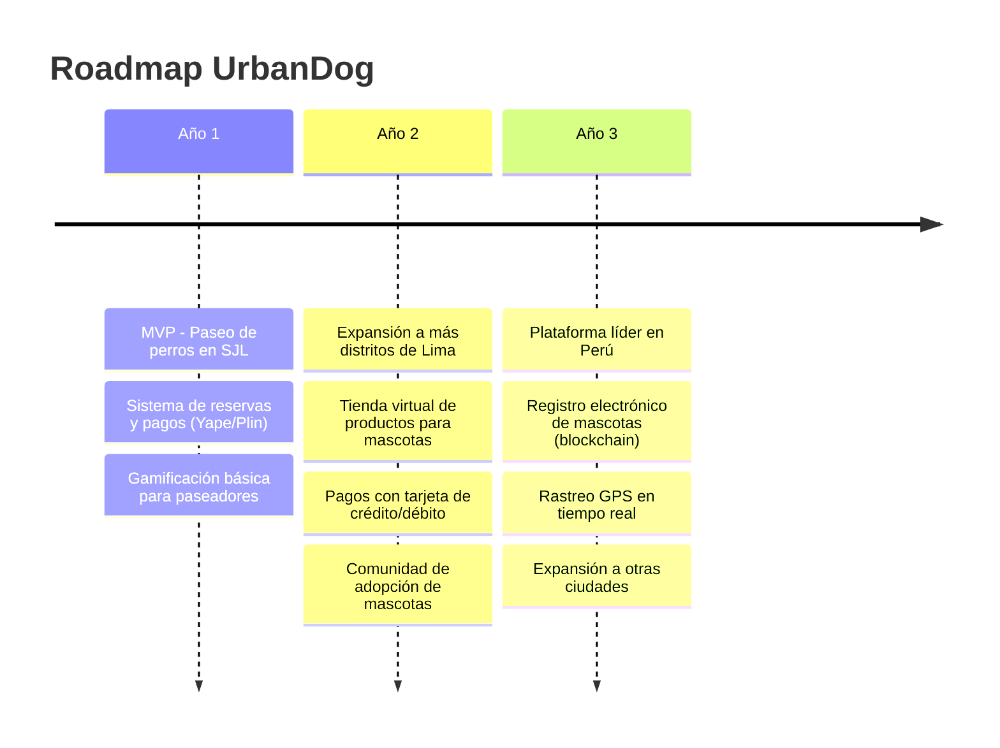
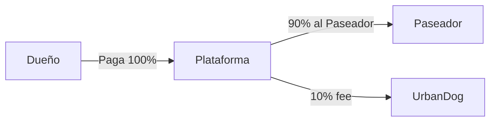
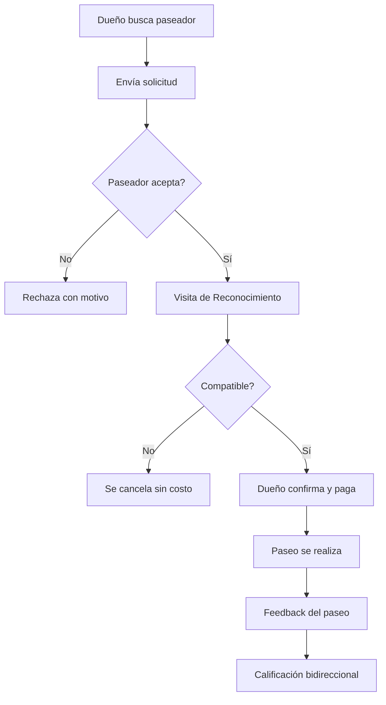

# PRD — UrbanDog
### Plataforma de Conexión entre Dueños de Mascotas y Paseadores de Perros

**Versión:** 1.0  
**Fecha:** 12 de febrero de 2026  
**Estado:** Borrador para revisión

---

## 1. Resumen Ejecutivo

UrbanDog es una plataforma web responsive que conecta **dueños de mascotas** con **paseadores de perros** verificados en su zona local. El servicio se diferencia por su enfoque en seguridad (verificación de antecedentes, visita de reconocimiento previa), gamificación para paseadores, y capacitación continua dentro de la plataforma.

**Mercado inicial:** San Juan de Lurigancho, Lima, Perú.  
**Moneda:** Nuevos Soles (PEN).  
**Meta 6 meses:** 100–500 usuarios registrados.

---

## 2. Problema y Oportunidad

### Problema
- Los dueños de mascotas no tienen una forma segura y confiable de contratar paseadores de perros.
- Los paseadores (principalmente jóvenes universitarios y amantes de animales) no tienen una plataforma que los conecte con clientes de manera profesional y rentable.
- No existe competencia directa en el mercado local de Lima.

### Oportunidad
- Mercado desatendido en Lima, especialmente en distritos con alta densidad de mascotas.
- Tendencia creciente de humanización de mascotas y disposición a pagar por servicios de cuidado.
- Diferenciación mediante gamificación y verificación de paseadores.

---

## 3. Visión a 3 Años

---

## 4. Usuarios Objetivo

### 4.1 Dueño de Mascota (Cliente)

| Atributo | Detalle |
|----------|---------|
| Edad mascota | 1–10 años |
| NSE | Medio-alto |
| Hábitos | Cuidado regular de mascota |
| Necesidad | Paseo seguro y confiable para su perro |

### 4.2 Paseador de Perros (Proveedor)

| Atributo | Detalle |
|----------|---------|
| Edad | 18–25 años |
| Perfil | Estudiantes universitarios, amantes de animales |
| Motivación | Ingreso extra + pasión por animales |
| Verificación | DNI, foto, LinkedIn, antecedentes policiales |

---

## 5. Servicios

### 5.1 Servicio Principal: Paseo de Perros

| Modalidad | Descripción |
|-----------|-------------|
| **Individual** | 1 perro, atención exclusiva |
| **Grupal** | Hasta 5 perros de raza y tamaño similar |
| **Duración** | 30 minutos o 1 hora |

### 5.2 Planes de Contratación

| Plan | Descripción |
|------|-------------|
| Por paseo | Pago único por un paseo |
| Semanal | Paquete de paseos por semana |
| Mensual | Paquete de paseos por mes |

> [!NOTE]
> Los precios son definidos por cada paseador según su zona, experiencia y competencia. No hay precio fijo de la plataforma.

---

## 6. Modelo de Monetización

| Concepto | Detalle |
|----------|---------|
| **Quién paga** | El dueño de la mascota |
| **Comisión** | 10% sobre cada transacción |
| **Método de pago MVP** | Yape / Plin (QR o número de teléfono) |
| **Método de pago futuro** | Tarjeta de crédito y débito |
| **Moneda** | Nuevos Soles (PEN) |

---

## 7. Funcionalidades por Rol

### 7.1 Dueño de Mascota

#### Registro y Perfil
- Nombre, apellido, email, teléfono, contraseña
- Sin verificación de identidad obligatoria
- Verificación opcional futura para registro de mascotas a su nombre

#### Perfil de Mascota (múltiples)
- Nombre, raza, tamaño, temperamento
- Necesidades especiales, vacunas
- Foto de la mascota

#### Búsqueda de Paseadores
- Por disponibilidad
- Por mapa (zona cercana)
- Por lista
- Por calificación/reseñas

#### Dashboard del Dueño
- Historial de paseos
- Mascotas registradas
- Reservas activas/pendientes
- Calificaciones dadas

### 7.2 Paseador de Perros

#### Registro y Verificación

| Dato | Obligatorio |
|------|:-----------:|
| Nombre, apellido, email, teléfono | ✅ |
| Foto de DNI | ✅ |
| Foto personal | ✅ |
| Perfil de LinkedIn | ✅ |
| Antecedentes policiales | ✅ |

> [!IMPORTANT]
> El paseador debe ser **aprobado por un administrador** antes de poder ofrecer servicios. Este proceso de verificación es clave para la propuesta de valor de seguridad.

#### Configuración del Servicio
- Zona de cobertura (define en mapa)
- Horario de disponibilidad
- Precio por paseo (individual/grupal, 30min/1hr)
- Máximo 5 perros simultáneos (misma raza/tamaño)

#### Dashboard del Paseador
- Solicitudes entrantes (aceptar/rechazar con motivo)
- Agenda/calendario de paseos
- Historial de ingresos
- Calificaciones recibidas
- Progreso en gamificación

### 7.3 Administrador

- Aprobar/rechazar paseadores
- Gestión de disputas y soporte
- Métricas de la plataforma
- Gestión de usuarios

---

## 8. Flujos Críticos

### 8.1 Flujo de Contratación

> [!IMPORTANT]
> **La Visita de Reconocimiento es obligatoria** antes del primer paseo con un paseador nuevo. Permite evaluar la compatibilidad entre paseador y mascota. Es presencial y sin costo.

### 8.2 Flujo de Pago

1. Dueño selecciona plan (por paseo / semanal / mensual)
2. Se muestra el total según precio del paseador
3. Dueño paga vía **Yape o Plin** (QR o número de teléfono)
4. Paseador confirma recepción → se activa el paseo
5. Plataforma retiene 10% de comisión

### 8.3 Cancelaciones

| Momento | Penalidad |
|---------|-----------|
| +24 hrs antes del paseo | Sin penalidad |
| -24 hrs antes del paseo | 50% del costo del paseo |

### 8.4 Resolución de Disputas
- Soporte técnico a través de la plataforma
- La visita de reconocimiento previa reduce conflictos
- **La plataforma no se hace responsable** por eventualidades durante el paseo

---

## 9. Comunicación

| Canal | Uso |
|-------|-----|
| **WhatsApp** | Comunicación directa entre dueño y paseador |
| **Email** | Confirmaciones de registro y transacciones |
| **Plataforma** | Notificaciones de solicitudes, estado de paseos |

### Calificaciones y Reseñas
- Sistema bidireccional (dueño califica paseador y viceversa)
- Solo disponible después de completar un paseo
- Visible en el perfil público del paseador

---

## 10. Gamificación (Paseadores)

| Elemento | Descripción |
|----------|-------------|
| **Niveles** | Paseador novato → Experto → Maestro |
| **Badges** | Por cantidad de paseos, calificaciones, capacitaciones |
| **Capacitación** | Módulos dentro de la plataforma sobre cuidado animal |
| **Ranking** | Tabla de posiciones por zona |

> La gamificación motiva a los paseadores a mejorar su servicio y completar capacitaciones, lo que a su vez mejora la calidad general de la plataforma.

---

## 11. Diseño y Marca

| Aspecto | Detalle |
|---------|---------|
| Logo | Por definir |
| Colores | Por definir |
| Tipografía | Por definir |
| Tono | **Amigable y divertido** |
| Referencias | Screenshots proporcionados por el cliente |
| Plataforma | Web responsive (mobile-first) |

---

## 12. Stack Técnico

| Componente | Tecnología |
|------------|-----------|
| CMS | WordPress 6.7+ |
| E-commerce | WooCommerce |
| PHP | 8.3 |
| Base de datos | MySQL 8.0 |
| Entorno local | Docker |
| Hosting producción | Hosting compartido (provisto) |
| SSL | Provisto con hosting |
| Dominio | Provisto |

> [!IMPORTANT]
> **Restricción de presupuesto:** No hay presupuesto para plugins premium. Todo debe desarrollarse de forma nativa (tema custom, funcionalidades custom mediante plugins propios).

---

## 13. Requisitos Legales

| Aspecto | Estado |
|---------|--------|
| Términos y condiciones | Pendiente de redactar |
| Política de privacidad | Pendiente de redactar |
| Seguro de responsabilidad civil | No aplica por ahora |
| Regulaciones locales | No identificadas |

> [!WARNING]
> Se recomienda obtener asesoría legal antes del lanzamiento para proteger tanto a la plataforma como a los usuarios, especialmente dado que la plataforma declara no hacerse responsable por eventualidades durante los paseos.

---

## 14. Alcance del MVP vs Futuro

### MVP (Lanzamiento)

- [x] Landing page de UrbanDog
- [x] Registro de dueños de mascotas
- [x] Registro y verificación de paseadores
- [x] Perfil de mascotas (múltiples)
- [x] Búsqueda de paseadores (mapa, lista, disponibilidad, calificación)
- [x] Flujo de solicitud → visita de reconocimiento → reserva
- [x] Pago por Yape / Plin
- [x] Dashboard personalizado por tipo de usuario
- [x] Sistema de calificaciones y reseñas bidireccional
- [x] Feedback post-paseo
- [x] Panel de administración

### Post-MVP (Fase 2+)

- [ ] Rastreo GPS en tiempo real
- [ ] Chat interno en la plataforma
- [ ] Notificaciones push
- [ ] Pagos con tarjeta de crédito/débito
- [ ] Tienda virtual de productos para mascotas
- [ ] Comunidad de adopción
- [ ] Registro electrónico de mascotas (blockchain)
- [ ] Sistema completo de gamificación
- [ ] Expansión geográfica

---

## 15. Métricas de Éxito

| Métrica | Objetivo 6 meses |
|---------|-------------------|
| Usuarios registrados | 100–500 |
| Paseadores activos | 20–50 |
| Paseos completados/mes | 200+ |
| Calificación promedio | ≥ 4.5/5 |
| Tasa de retención dueños | ≥ 40% |

---

## 16. Riesgos y Mitigaciones

| Riesgo | Impacto | Mitigación |
|--------|---------|------------|
| Pocos paseadores al inicio | Alto | Campaña de reclutamiento en universidades de SJL |
| Incidentes durante paseos | Alto | Visita de reconocimiento obligatoria + verificación de antecedentes |
| Falta de asesoría legal | Medio | Obtener T&C y políticas antes de producción |
| Pagos solo por Yape/Plin | Medio | Flujo manual inicial; integrar pasarela de pagos en Fase 2 |
| Dependencia de WhatsApp | Bajo | Suficiente para MVP; chat interno en Fase 2 |
